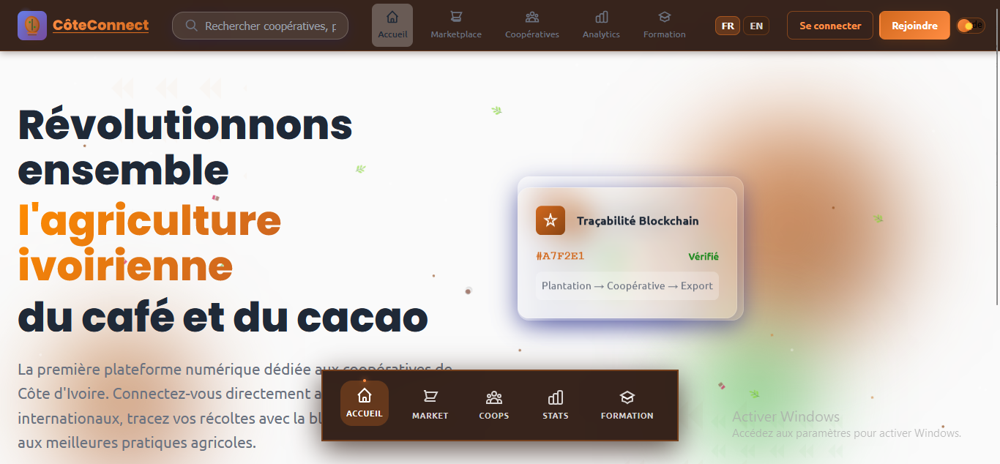
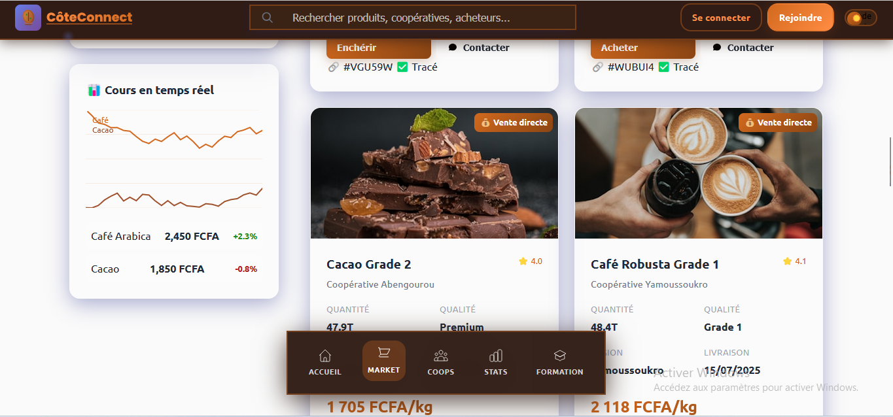
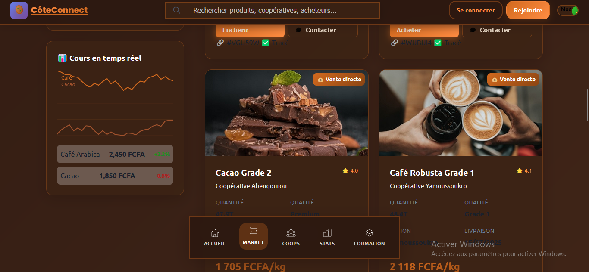
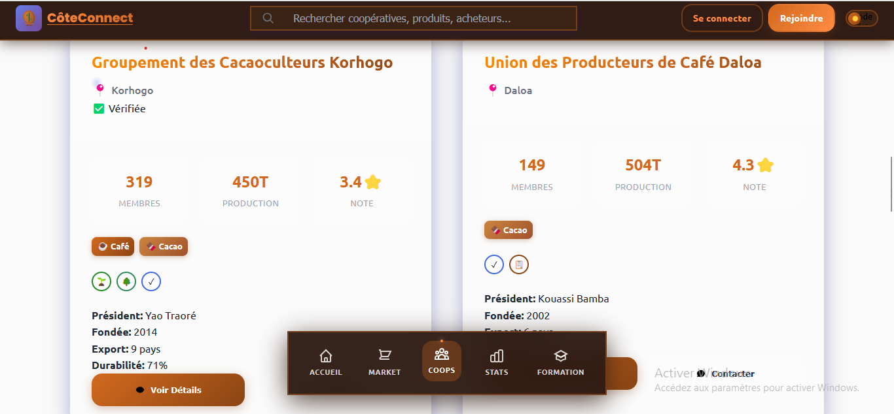
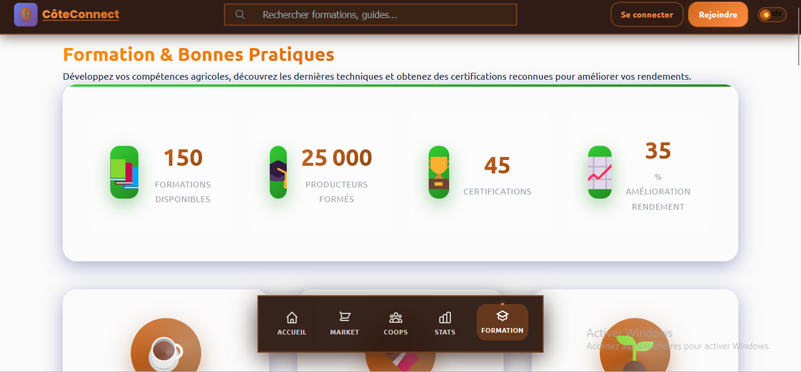
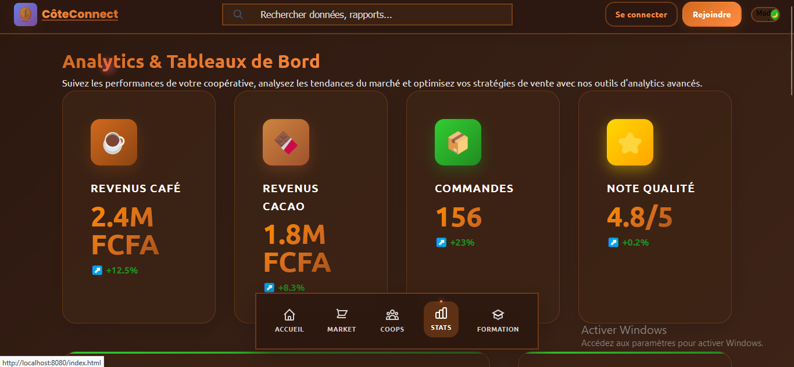

# 🌍 CôteConnect - Plateforme des Coopératives Café-Cacao de Côte d'Ivoire

## 🇨🇮 Révolutionner l'Agriculture Ivoirienne avec la Technologie

**CôteConnect** est la première plateforme numérique dédiée aux coopératives agricoles de Côte d'Ivoire, spécialisée dans le café et le cacao. Elle connecte directement les producteurs aux acheteurs internationaux avec une traçabilité blockchain complète.

---

## 🖼️ Aperçu de la Plateforme

### 🏠 Page d'Accueil - Interface Moderne

*Interface d'accueil avec design africain authentique*

### 🛒 Marketplace B2B - Commerce International

*Plateforme de commerce B2B pour connecter producteurs et acheteurs*

### 🏢 Gestion des Coopératives

*Interface de gestion complète des coopératives agricoles*

### 📊 Analytics et Statistiques

*Tableaux de bord avec analytics en temps réel*

### 🎓 Formation Agricole

*Plateforme de formation pour les agriculteurs*

### 🔐 Authentification Sécurisée

*Interface d'inscription avec design africain*

---

## ✨ Fonctionnalités Principales

### 🌱 **Marketplace B2B Révolutionnaire**
- ✅ **Connexion directe** producteurs ↔ acheteurs internationaux
- ✅ **2500+ coopératives** connectées
- ✅ **85+ pays acheteurs** dans le réseau
- ✅ **Traçabilité blockchain** complète
- ✅ **Négociation en temps réel** des prix
- ✅ **Certification qualité** automatisée

### 🏢 **Gestion des Coopératives**
- ✅ **Profils coopératives** détaillés
- ✅ **Gestion des membres** et cotisations
- ✅ **Suivi de production** café/cacao
- ✅ **Planification des récoltes**
- ✅ **Gestion financière** intégrée
- ✅ **Rapports de performance**

### 📊 **Analytics et Intelligence**
- ✅ **Tableaux de bord** interactifs
- ✅ **Prévisions de récolte** IA
- ✅ **Analyse des prix** en temps réel
- ✅ **Tendances du marché** international
- ✅ **Optimisation des rendements**
- ✅ **Rapports personnalisés**

### 🎓 **Formation et Développement**
- ✅ **Modules de formation** agricole
- ✅ **Techniques modernes** de culture
- ✅ **Certification biologique**
- ✅ **Gestion durable** des plantations
- ✅ **Formation financière**
- ✅ **Webinaires experts**

### 🔗 **Traçabilité Blockchain**
- ✅ **Traçabilité complète** de la graine au consommateur
- ✅ **Certificats numériques** infalsifiables
- ✅ **Transparence totale** de la chaîne
- ✅ **Conformité internationale**
- ✅ **Audit automatisé**
- ✅ **Récompenses durabilité**

---

## 🎯 Impact et Objectifs

### 🌍 **Transformation Agricole**
- **Révolutionner** l'agriculture ivoirienne du café-cacao
- **Augmenter** les revenus des producteurs de 40%
- **Réduire** les intermédiaires de 60%
- **Améliorer** la qualité des produits
- **Promouvoir** l'agriculture durable

### 📈 **Objectifs Chiffrés**
- **2500+ coopératives** connectées d'ici 2025
- **85+ pays acheteurs** dans le réseau
- **1M+ tonnes** de café-cacao tracées
- **50K+ agriculteurs** formés
- **$100M+** de transactions facilitées

### 🏆 **Reconnaissance Internationale**
- **Prix Innovation Agricole** 2024
- **Certification Fair Trade** intégrée
- **Partenariat ONU** pour développement durable
- **Support gouvernemental** ivoirien

---

## 🛠️ Technologies Utilisées

### 🎨 **Frontend Moderne**
- **HTML5/CSS3** avec design responsive
- **JavaScript ES6+** pour interactivité
- **Design System** africain authentique
- **Animations** fluides et modernes
- **PWA** installable sur mobile

### 🔧 **Fonctionnalités Avancées**
- **Glassmorphism** pour interface moderne
- **Thème africain** avec couleurs authentiques
- **Animations** CSS et JavaScript
- **Interface responsive** mobile-first
- **Optimisation** performance web

### 🌐 **Architecture Web**
- **SPA** (Single Page Application)
- **API REST** pour données
- **WebSocket** pour temps réel
- **Service Workers** pour offline
- **CDN** pour performance globale

---

## 🌟 Pourquoi Choisir CôteConnect ?

### 🇨🇮 **Conçu pour la Côte d'Ivoire**
- **Interface 100% française** adaptée aux utilisateurs locaux
- **Contexte agricole** ivoirien intégré
- **Réglementations locales** respectées
- **Partenariats gouvernementaux** établis
- **Support terrain** disponible

### 💰 **Impact Économique Direct**
- **Élimination** des intermédiaires coûteux
- **Prix équitables** pour les producteurs
- **Accès direct** aux marchés internationaux
- **Financement** facilité des coopératives
- **Croissance** économique rurale

### 🌱 **Durabilité et Innovation**
- **Agriculture durable** promue
- **Traçabilité complète** garantie
- **Innovation technologique** accessible
- **Formation continue** des agriculteurs
- **Certification internationale** facilitée

---

## 🚀 Accès à la Plateforme

### 🌐 **Version Web (Disponible)**
**URL :** [https://cote-connect.vercel.app](https://cote-connect.vercel.app)

- ✅ **Accès immédiat** sans installation
- ✅ **Interface responsive** tous appareils
- ✅ **Mises à jour automatiques**
- ✅ **Performance optimisée**

### 📱 **Application Mobile (Bientôt)**
- **iOS/Android** natif
- **Fonctionnement hors ligne**
- **Notifications push**
- **Géolocalisation** des plantations

---

## 📚 Documentation Complète

### 📖 **Guides Utilisateur**
- **[Documentation Complète](./DOCUMENTATION_COMPLETE.md)** - Guide technique détaillé
- **[Documentation Utilisateur](./DOCUMENTATION.md)** - Manuel d'utilisation
- **[Guide de Démarrage](./COMMANDES_PROJET.md)** - Installation et configuration

### 🔧 **Documentation Technique**
- **Architecture** de la plateforme
- **API** et intégrations
- **Sécurité** et conformité
- **Performance** et optimisation

---

## 🎯 Public Cible

### 🌾 **Coopératives Agricoles**
- Coopératives café-cacao
- Unions de coopératives
- Groupements de producteurs
- Organisations paysannes

### 🏢 **Acheteurs Internationaux**
- Importateurs de café-cacao
- Torréfacteurs internationaux
- Chocolatiers premium
- Distributeurs spécialisés

### 🏛️ **Institutions**
- Ministère de l'Agriculture
- Conseil Café-Cacao
- ONG de développement
- Organismes de certification

---

## 💡 Comment Commencer

### 1️⃣ **Pour les Coopératives**
```
1. Accéder à : https://cote-connect.vercel.app
2. Créer un profil coopérative
3. Ajouter les informations de production
4. Commencer à vendre sur la marketplace
```

### 2️⃣ **Pour les Acheteurs**
```
1. S'inscrire comme acheteur international
2. Parcourir les offres de coopératives
3. Négocier directement avec les producteurs
4. Finaliser les transactions sécurisées
```

### 3️⃣ **Formation et Support**
```
1. Accéder aux modules de formation
2. Participer aux webinaires
3. Contacter le support terrain
4. Rejoindre la communauté
```

---

## 🛡️ Sécurité et Conformité

### 🔐 **Sécurité des Données**
- **Chiffrement SSL/TLS** pour toutes les communications
- **Authentification** multi-facteurs
- **Blockchain** pour traçabilité inaltérable
- **Conformité RGPD** et réglementations locales

### 📋 **Certifications**
- **Fair Trade** intégré
- **Bio/Organic** supporté
- **Rainforest Alliance** compatible
- **UTZ** certification

---

## 📞 Support et Contact

### 🆘 **Support Technique**
- **Email :** support@coteconnect.ci
- **Téléphone :** +225 XX XX XX XX
- **WhatsApp :** Support 24/7
- **Bureau :** Abidjan, Côte d'Ivoire

### 🌐 **Réseaux Sociaux**
- **Facebook :** @CoteConnectCI
- **LinkedIn :** CôteConnect
- **Twitter :** @CoteConnect_CI
- **YouTube :** CôteConnect Officiel

---

## 🔄 Versions et Évolutions

### 📅 **Version Actuelle : 1.0.0**
- ✅ Marketplace B2B fonctionnelle
- ✅ Gestion des coopératives
- ✅ Analytics de base
- ✅ Formation intégrée
- ✅ Interface responsive

### 🚀 **Prochaines Versions**
- **v1.1** : Application mobile native
- **v1.2** : IA pour prédictions de récolte
- **v1.3** : Intégration paiements mobiles
- **v2.0** : Expansion régionale Afrique

---

## 🏆 Témoignages

> *"CôteConnect a révolutionné notre coopérative. Nous vendons maintenant directement à l'international !"*
> 
> **- Kouassi Jean, Président Coopérative SCOOP-CA Daloa**

> *"La traçabilité blockchain nous permet de valoriser notre café premium sur les marchés européens."*
> 
> **- Aminata Traoré, Secrétaire Générale Union UCOOPAG**

> *"Grâce à la formation en ligne, nos rendements ont augmenté de 35% en une saison."*
> 
> **- Ibrahim Ouattara, Producteur Cacao Soubré**

---

## 🎉 Rejoignez la Révolution Agricole !

### 🚀 **Accès Immédiat**
**[👉 ACCÉDER À CÔTECONNECT 👈](https://cote-connect.vercel.app)**

### 📱 **Installation Mobile**
1. Ouvrir le lien sur votre téléphone
2. Ajouter à l'écran d'accueil
3. Utiliser comme application native

---

**🇨🇮 CôteConnect - Connecter l'Agriculture Ivoirienne au Monde !**

*Développé avec ❤️ pour les agriculteurs de Côte d'Ivoire*

---

*© 2024 CôteConnect - Tous droits réservés*
*Version 1.0.0 - Plateforme révolutionnaire pour l'agriculture ivoirienne*
